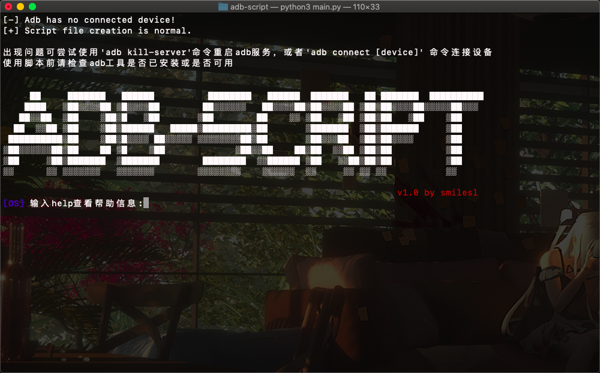

 

# 说明

这是第一代Adb脚本创建工具，全部由python代码+adb工具实现对手机的自动化操作
由霜冷SmileSL制作，由于是初代的学习产品，还有很多不完善的，主要是想自己作出属于自己的工具，不想总用大佬的工具，这样会有莫名的成就感（奇奇怪怪的，明明没做出什么有用的功能），总的来说还会继续开发下去，逐步完善和优化功能

> 需要注意的是main.py文件只具有少量的测试功能，自动化脚会根据你选择的功能继续逐行添加，保存在了同级目录`script`文件夹中，运行其中的文件来进行自动化操作
> 本脚本依赖于adb工具运行，需要配置adb环境变量后使用

# 目录结构

- apk

> 存储apk文件

- data

> 存储用户保存的数据，如包名

- script

> 存储用户创建的脚本

- adb.py

> adb 功能实现

- fileInit.py

> 文件初始化以及创建

- main.py

> 运行此文件开始创建脚本

# 使用帮助

**exit -  退出**

**getevent  - 打开终端监听事件数据**

**sendevent - 测试并执行获取的事件**

**saveevent - 保存事件代码到脚本文件**

**click [num1] [num2] - 点击屏幕(x,y)点**
    [num] 点击点(x,y)的坐标数值
**keyevent  -  查看所有系统按键**
**key [num] -  点击按键**
    [num] 按键代码，输入keyevent命令查看代码
**wait [num]-  等待num秒，单位秒**
**swipe     - 向上滑动一段距离【可用于解锁手机】**
**state     -  查看adb连接手机状态**

**install [-r] [file.apk] -  安装软件**
    -r  可选参数，覆盖原有的apk进行安装
    [file.apk] 要安装的App路径
**uninstall [-k] [package] -  卸载软件**
    -k  可选参数，保留apk配置文件卸载

**pkg  -  显示所有包名**
    -s 只显示系统应用
    -3 只显示第三方应用
**savepkg [file] [mode] - 保存所有包名到文件默认为 data\packages.txt**
    [file] 可选参数，自定义保存文件路径
    [mode] 可选参数，保存包名类型，参数同pkg命令
**showact - 显示当前页面的Activity**
    --launcher 可选参数，找到App启动页面的Activity 

# 关于新添功能动作录制类的使用

在使用帮助中新添加三条命令：

> **getevent  - 打开终端监听事件数据**
>
> **sendevent - 测试并执行获取的事件**
>
> **saveevent - 保存事件代码到脚本文件**

与其他命令不同是的，这个功能不需要用户自己输入想要点击的位置，具有进行类似自动录制的功能，当用户在手机上操作完【点击/滑动】事件之后保存数据，即可自动分析并添加到脚本中

## 如何使用

1. 脚本终端输入`getevent`，即可开启录制功能，在手机上执行【点击/滑动】事件即可产生代码<u>【注意：Windows系统需要手动在cmd输入下面的代码】</u>`adb shell getevent -t | grep -e "0035" -e "0036"`
2. 

2. 将打开终端的代码复制到[data/event_temp.txt]文件中并保存
3. 使用`sendevent`执行录制的动作事件，查看效果
4. 使用`saveevent`保存动作事件到脚本文件
